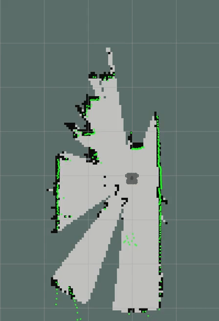

# 📌 Safe Learning for Multi-Robot Mapless Exploration

This is the supplementary material for the paper **Safe Learning for Multi-Robot Mapless Exploration**. 

This Python project uses **Deep Reinforcement Learning (DRL)** to train a **TurtleBot3 Waffle Pi** for autonomous navigation **without relying on pre-built maps**. The training enables the robot to perform **mapless exploration** and **avoid obstacles** in simulated dynamic environments.

Built within the **Robot Operating System (ROS)** framework, this implementation leverages **Gazebo** for realistic simulation and **PyTorch** for DRL model development.

---


## 🧠 Exploration Demo
<p align="center">
  &nbsp;&nbsp;&nbsp&nbsp;&nbsp;&nbsp&nbsp;&nbsp;&nbsp;
  
</p>


---

## 📖 Getting Started

These instructions will help you get the project running on your local machine for development and testing.

---

## 📋 Prerequisites

Before starting, ensure you have the following installed:

- **Ubuntu 20.04**
- **ROS Noetic**
- **Python 3.8**
- **PyTorch 1.10.0**  
  You can install it using [Anaconda](https://www.anaconda.com/products/distribution) to manage a virtual environment.
- **NumPy 1.24.4**

---

## 📦 Installation

### Install TurtleBot3 and dependencies:

```bash
sudo apt-get update
sudo apt-get upgrade

cd ~/catkin_ws/src/
git clone https://github.com/ROBOTIS-GIT/turtlebot3.git
git clone https://github.com/ROBOTIS-GIT/turtlebot3_msgs.git
git clone https://github.com/ROBOTIS-GIT/turtlebot3_simulations.git
git clone https://github.com/ROBOTIS-GIT/turtlebot3_machine_learning.git
git clone https://github.com/ros-perception/laser_filters.git

cd ~/catkin_ws
catkin_make
```

---

## 📥 Clone this Repository

```bash
cd ~/catkin_ws/src/
git clone https://git.ccfe.ac.uk/ld6972/safe-learning-for-multi-robot-mapless-exploration2.git
```

---

## 🔧 Modify the TurtleBot3 Laser Scanner Resolution

The default **TurtleBot3 Waffle Pi** LiDAR sensor publishes **360 rays**. For this project, we reduce it to **24 rays** to simplify the DRL input and speed up simulation.

### 📁 File to Modify:
```
~/catkin_ws/src/turtlebot3/turtlebot3_description/urdf/turtlebot3_waffle_pi.gazebo.xacro
```

### 📝 What to Change:
Find this line:
```xml
<samples>360</samples>
```
And change it to:
```xml
<samples>24</samples>
```

### 🔧 Or Use This Command:
You can automate this edit by running:
```bash
sed -i 's/<samples>360<\/samples>/<samples>24<\/samples>/g' ~/catkin_ws/src/turtlebot3/turtlebot3_description/urdf/turtlebot3_waffle_pi.gazebo.xacro
```

### 🔄 Rebuild the Workspace:
After making the change, rebuild your workspace:
```bash
cd ~/catkin_ws
catkin_make
source devel/setup.bash
```

Now, your simulated LiDAR scanner will publish 24 rays instead of 360.

---

## 🚀 Running the Simulation

### 1️⃣ Start Gazebo World  

When we say **"starting a Gazebo world"**, it means launching a simulated environment in **Gazebo**, which is a powerful 3D robotics simulator integrated with ROS. A **Gazebo world** is essentially a virtual space with models, obstacles, and physics where your robot can navigate, interact, and be tested safely before deploying in the real world.

**What happens when you start a Gazebo world:**
- Loads a virtual environment (walls, obstacles, floor)
- Spawns your TurtleBot3 robot model into the environment
- Starts the ROS nodes that publish data like LaserScan, Odometry, and TFs
- Initializes physics simulation for realistic robot behavior

Learn more about Gazebo here: [Gazebo: Simulating Robots](http://gazebosim.org/tutorials?tut=ros_overview)

**Launch the simulation:**

```bash
roslaunch tvt20_bot single_bot.launch
```

### 2️⃣ In a New Terminal — Start DRL Training

```bash
roslaunch tvt20_bot single_tvt_torch.launch
```

### 🔄 Purpose of the Launch Files

- **`single_bot.launch`**  🔺 **Starts the robot and Gazebo world**  
  - Loads the robot model
  - Sets up the simulation environment
  - Initializes ROS nodes and Gazebo physics

- **`single_tvt_torch.launch`**  🔺 **Starts the Deep Reinforcement Learning training**  
  - Launches the DRL Python training scripts
  - Subscribes to topics like `/scan` and `/odom`
  - Begins training using the simulation data and environment feedback

**In short:**
- `single_bot.launch` = Starts the robot + simulated world  
- `single_tvt_torch.launch` = Starts the DRL training process (that uses the simulation)

---

## 📚 Assumed Background Knowledge

To effectively use this project, you should be familiar with:

- **Building and running ROS workspaces**
- **Gazebo simulator**
- **Basic concepts of DRL**
- **Linux terminal operations**
- **Python and PyTorch basics**

If you're new to ROS, a good place to start is the [official ROS tutorials](http://wiki.ros.org/ROS/Tutorials).

